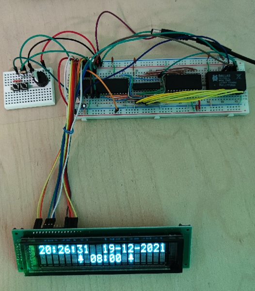

# Simple alarm clock

Based on MCS48 microcontroller, DS12887 RTC and HD44780-compatible 20x2 VFD display. Basic functionalities – setting time, date and alarm, enabling and disabling alarm, turning alarm off after it has fired. Two-button interface.

This time DS12887 is connected as it should be – as an external RAM memory. I got this idea from [here](https://github.com/retiredfeline/8048-board).
In the previous projects I was interfacing it using general purpose ports. Such approach wastes a lot of valuable pins just to control that RTC, and also requires writing proper routines performing read/write operations. It was the beginning of my adventure with such MCUs and I just didn’t know there’s better way to interface this RTC… Connecting it as an external RAM means that not even one GPIO pin has to be used and all read/write operations are just one native instruction – MOVX. So yeah, way better…

## TODO
If someone would really like to turn this idea into some useful project, I’d consider saving alarm enabled flag and alarm time inside DS12887 NVRAM and reading it at the startup. This way the alarm won’t lose its settings after power outage.